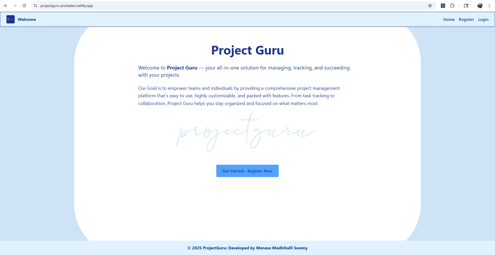
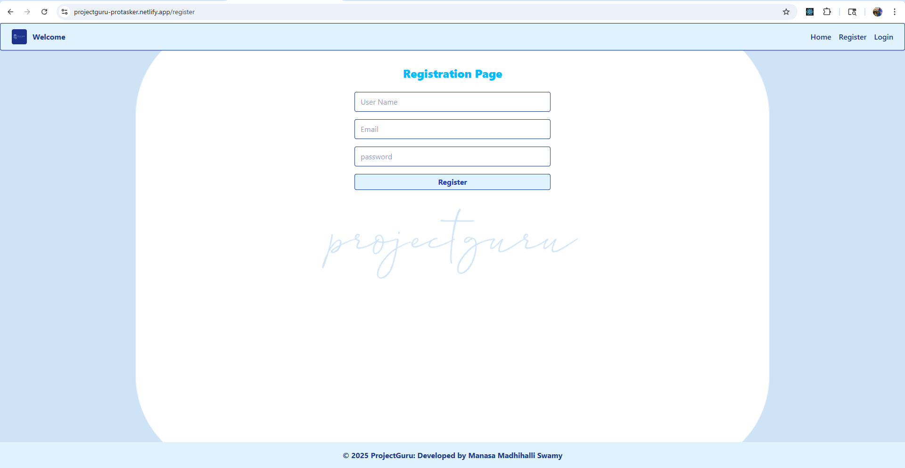
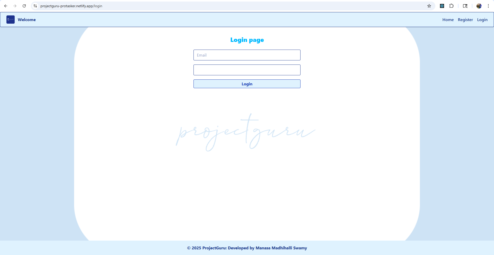
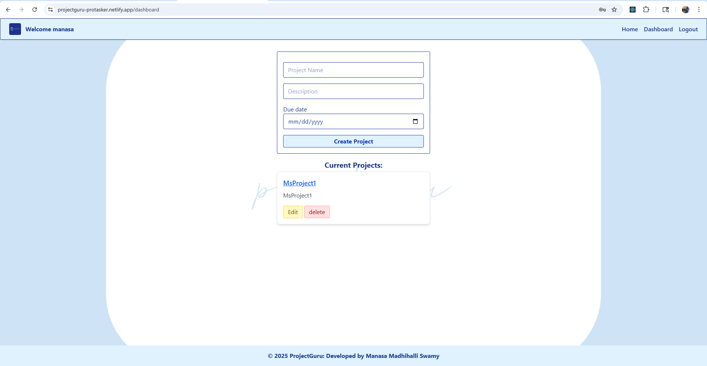
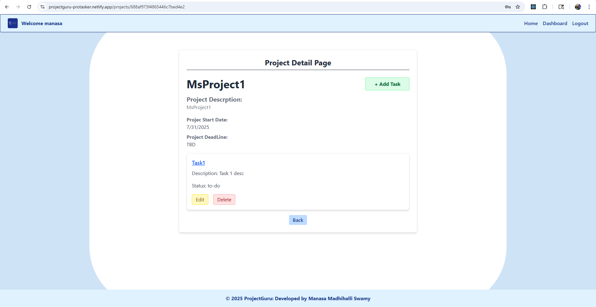

# 🚀 ProjectGuru Frontend – Interactive Project Management UI

---

## 📌 Overview

The **ProjectGuru** is a modern, responsive, and interactive web application built using **React.js**, **Tailwind CSS**, and **JavaScript**. It serves as the user interface for managing projects, tasks, seamlessly communicating with the backend API for data persistence and user authentication.

Designed with usability and responsiveness in mind, this frontend supports, registering User, Logging in. Creating, editing, and deleting projects and tasks, while providing smooth user interactions like form toggling between "user" to "admin", error handling.

---

## 🎯 Core Features

- ✅ **User Authentication UI** integrating with backend login and registration.
- 📝 Create, view, edit, and delete **projects**.
- 📄 Interactive **tasks** creation, editing, deletion.
- 📱 Fully **responsive design** powered by **Tailwind CSS**.
- ⚠️ Friendly **error handling** and validation feedback.
- 💾 State management using React hooks, with API calls for persistent data.

---

## 📁 Project Structure

<prev>
projectguru-frontend/
├── public/             # Static assets & index.html
├── src/
│   ├── components/     # Reusable UI components 
│   ├── contexts/       # React Contexts for auth and state management
│   ├── hooks/          # Custom React hooks
│   ├── pages/          # Page-level components (Dashboard, Login, Register)
│   ├── client/         # API call logic (fetch/axios)
│   ├── assets/         
│   ├── utils/          # Helper functions and constants
│   ├── App.jsx          # Main React component and routing
│   └── main.jsx        # React DOM rendering entry point </prev>

## ⚙️ Technologies Used

- Vite 
- React.js (Frontend framework)
- Tailwind CSS for vite
- React Router (SPA routing)
- Axios or Fetch API (HTTP requests)
- React Context API (State and authentication management)
- ESLint / Prettier (Code quality tools)

## Prerequisites

- Node.js installed 
- npm
- Access to the ProjectGuru backend API
- Modern browser

## Setup & Running Locally

1. **Clone the repository:**

 - bash/terminal 
git clone "GitHub URL"
cd projectguru-frontend

2. **Install dependencies:**
npm install

3. Configure environment variables:
Create a .env file in the root directory with:
VITE_URL=http://localhost:3000/api

4. Start the development server:
npm run dev

5. Open http://localhost:3000 to view in browser.

### 📸 Screenshots

<h4>🏠 Home Page</h4>

<h4>📝 Registration Page</h4>

<h4>🔐 Login Page</h4>

<h4>🧭 DashBoard</h4>

<h4>📋 Project details Page</h4>

